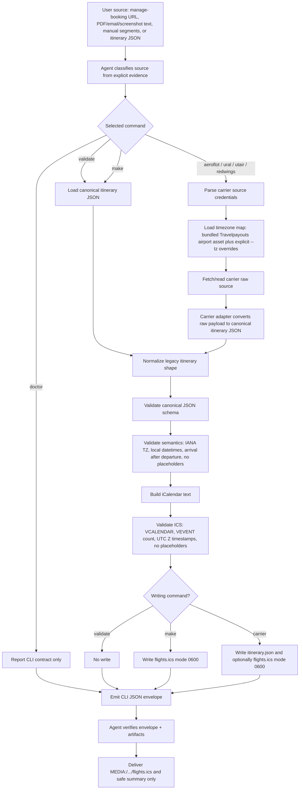

# Flight Calendar ICS process and data flow

This reference describes how data moves through `flight-calendar-ics`, where each transformation happens, and how the skill is decomposed. It is for maintenance, reviews, and onboarding; the ordinary agent path remains the shorter command matrix in `SKILL.md`.

## Scope

The skill converts flight booking evidence into an importable `.ics` file. It does not search flights, compare fares, or book tickets.

Primary invariant: one normalized `flights[]` segment becomes one `VEVENT`; local ticket times are converted to UTC `DTSTART`/`DTEND`; private booking identifiers stay out of stdout/chat and are allowed only in private artifacts when needed for the deliverable.

## High-level flow



Linear view:

```text
source evidence
  -> source classification
  -> one CLI command with --json
  -> source parsing / input loading
  -> optional carrier fetch
  -> canonical itinerary JSON
  -> schema validation
  -> semantic validation
  -> ICS build
  -> ICS validation
  -> private artifact write
  -> redacted CLI envelope
  -> agent verification
  -> Telegram delivery
```

## Data layers

1. **Source evidence layer**
   - Examples: carrier manage-booking URL, ticket PDF, email text, screenshot, pasted manual segment list, or existing canonical itinerary JSON.
   - May contain private values: PNR, access keys, passenger names, ticket numbers, full booking URLs.
   - Owner: agent for classification; carrier adapter or manual normalization for extraction.

2. **Carrier/raw source layer**
   - Examples: Aeroflot PNR API response, Ural reservation response, Utair order response, Red Wings/Websky order response.
   - Provider-specific and potentially private.
   - Owner: carrier helper module.
   - Boundary: raw fields must not leak into the shared canonical contract except through intentionally mapped safe/common fields or `extensions` when unavoidable.

3. **Timezone support layer**
   - Input: airport IATA codes from carrier/raw data or manual JSON.
   - Main source: `assets/travelpayouts/airport_timezones.json`.
   - Override: repeated `--tz CODE=Area/City` arguments; overrides win over the bundled asset.
   - Diagnostic: carrier commands expose `process[].step=load_timezone_map` with `catalog_source`, `catalog_timezones_count`, `defaults_count`, and `overrides_count`.

4. **Canonical itinerary layer**
   - Schema: `schemas/itinerary.v1.schema.json`.
   - Runtime validation: `scripts/itinerary_contract.py`.
   - Required top-level fields: `schema_version: flight-calendar-ics-itinerary.v1`, `flights[]`.
   - Required per segment: `flight_number`, `departure.airport`, `departure.local`, `departure.tz`, `arrival.airport`, `arrival.local`, `arrival.tz`.
   - Meaning: one `flights[]` item is one flight segment and one generated calendar event.

5. **Calendar layer**
   - Builder: `scripts/make_flight_ics.py`.
   - Output: RFC 5545 `.ics` text with `BEGIN:VCALENDAR` and one `BEGIN:VEVENT` per segment.
   - Time handling: local departure/arrival datetimes are parsed with IANA timezones, then emitted as UTC `DTSTART`/`DTEND` ending in `Z`.
   - Event content: compact mobile-friendly `SUMMARY`, `LOCATION`, and `DESCRIPTION`; see `references/event-content-format.md` for the current passenger/date/city/time title and short PNR/ticket/route/aircraft/booking description contract.

6. **Artifact layer**
   - Carrier commands write normalized private `itinerary.json` and optionally private `flights.ics`.
   - `make` writes private `flights.ics` from an existing canonical JSON input.
   - `validate` writes nothing.
   - Private artifact permissions must be `0600`; output directories are created before write.

7. **CLI envelope layer**
   - Schema: `schemas/cli-envelope.v1.schema.json`.
   - Emitter: `scripts/flight_calendar_ics.py --json`.
   - Contains: `schema_version`, `ok`, `command`, ordered `process[]`, and either safe `data` or redacted `error`.
   - Does not contain: PNR keys, access keys, passenger names, ticket numbers, bearer tokens, full manage-booking URLs.

8. **Agent delivery layer**
   - Agent saves stdout to `envelope.json`, parses it, verifies required fields and artifacts, then sends `MEDIA:/absolute/path/flights.ics`.
   - Chat summary must stay operational and redacted: segment count, route/timing summary, and import instructions only.

## Command-specific decomposition

### `doctor`

Purpose: expose the CLI contract without touching itinerary data.

Steps:

1. `parse_args`.
2. Mark `load_input` as skipped.
3. Return entrypoint path, command list, JSON contract, canonical input contract, and sensitive stdout policy.
4. Emit the JSON envelope.

Data movement: no private user source is loaded or written.

### `validate`

Purpose: check an existing canonical itinerary JSON without writing `.ics`.

Steps:

1. Parse CLI args.
2. Load `--input` JSON.
3. Normalize legacy itinerary shape in memory.
4. Validate against `schemas/itinerary.v1.schema.json`.
5. Validate semantics: known IANA timezones, parseable local datetimes, arrival after departure in UTC, no placeholder required values.
6. Build calendar text in memory.
7. Validate generated ICS text in memory.
8. Mark `no_write`.
9. Emit safe segment summaries in the envelope.

Data movement: canonical JSON file -> in-memory normalized itinerary -> in-memory ICS -> redacted envelope.

### `make`

Purpose: create `.ics` from an existing canonical itinerary JSON.

Steps:

1. Run the same load, normalization, schema validation, semantic validation, calendar build, and ICS validation path as `validate`.
2. Write `.ics` to `--output` or the input basename with `.ics` suffix.
3. Force file mode `0600`.
4. Emit envelope with `segments_count`, safe segment summaries, `ics_path`, and `write_performed=true`.

Data movement: canonical JSON file -> in-memory normalized itinerary -> in-memory ICS -> private `.ics` artifact -> redacted envelope.

### `aeroflot`

Purpose: convert Aeroflot PNR data into canonical itinerary JSON and `.ics`.

Steps:

1. Parse `pnrLocator` and `pnrKey` from `--url`, or use explicit locator/key flags.
2. Load bundled Travelpayouts airport timezone map plus `--tz` overrides.
3. Fetch Aeroflot PNR data.
4. Convert carrier payload into canonical itinerary JSON.
5. Validate canonical schema and semantics.
6. Build and validate `.ics`.
7. Write private `--output-json` and optional private `--output-ics` as `0600`.
8. Emit redacted envelope.

Private flow: PNR key/locator go into the carrier fetch and may be represented inside private artifacts only when needed; stdout/chat must stay redacted.

### `ural`

Purpose: convert Ural Airlines manage-booking data into canonical itinerary JSON and `.ics`.

Steps:

1. Parse direct manage-booking URL or tracker redirect into locator and surname, or use explicit flags.
2. Load bundled Travelpayouts airport timezone map plus `--tz` overrides.
3. Fetch the current public frontend/config/helper path and derive request headers at runtime.
4. Fetch reservation data.
5. Convert reservation payload into canonical itinerary JSON.
6. Validate canonical schema and semantics.
7. Build and validate `.ics`.
8. Write private `--output-json` and optional private `--output-ics` as `0600`.
9. Emit redacted envelope.

Private flow: locator, surname, generated headers, and session details stay inside fetch/runtime paths and private artifacts; they are not printed.

### `utair`

Purpose: convert Utair order-management data into canonical itinerary JSON and `.ics`.

Steps:

1. Parse order-manage URL into `rloc` and `last_name`, or use explicit flags.
2. Load bundled Travelpayouts airport timezone map plus `--tz` overrides.
3. Fetch a short-lived public `client_credentials` token.
4. Fetch Utair orders filtered by locator and passenger surname.
5. Convert order payload into canonical itinerary JSON.
6. Validate canonical schema and semantics.
7. Build and validate `.ics`.
8. Write private `--output-json` and optional private `--output-ics` as `0600`.
9. Emit redacted envelope.

Private flow: locator, surname, passenger/ticket values, and bearer token must not be printed.

### `redwings`

Purpose: convert Red Wings/Websky direct email/manage-link data into canonical itinerary JSON and `.ics`.

Steps:

1. Accept only direct `#/find/<PNR>/<ACCESS_KEY>/Submit` source, or explicit `--pnr` plus `--access-key`.
2. Reject already-opened `#/booking/<ORDER_ID>/order` pages as insufficient source evidence.
3. Load bundled Travelpayouts airport timezone map plus `--tz` overrides.
4. Call Websky `FindOrder` with ID and secret.
5. Convert order payload into canonical itinerary JSON.
6. Validate canonical schema and semantics.
7. Build and validate `.ics`.
8. Write private `--output-json` and optional private `--output-ics` as `0600`.
9. Emit redacted envelope.

Private flow: PNR/access key and API secret stay in the fetch path and private artifacts; stdout/chat must stay redacted.

## Code/module decomposition

- `SKILL.md` — small-model operating contract: when to use the skill, source classification rules, command matrix, privacy rules, and verification checklist.
- `scripts/flight_calendar_ics.py` — single agent-facing CLI orchestrator and JSON-envelope owner.
- `scripts/aeroflot_pnr_to_itinerary.py` — Aeroflot source parser, fetcher, and adapter.
- `scripts/ural_airlines_to_itinerary.py` — Ural source parser, frontend/runtime API handling, fetcher, and adapter.
- `scripts/utair_to_itinerary.py` — Utair source parser, token/order fetcher, and adapter.
- `scripts/redwings_to_itinerary.py` — Red Wings/Websky source parser, order fetcher, and adapter.
- `scripts/itinerary_contract.py` — canonical itinerary normalization, JSON Schema validation, and semantic validation.
- `scripts/make_flight_ics.py` — carrier-agnostic calendar builder and ICS validator; also retained as a compatibility helper.
- `scripts/travelpayouts_airport_catalog.py` — builder/inspector/loader for the bundled airport timezone asset.
- `schemas/cli-envelope.v1.schema.json` — machine-readable contract for the CLI envelope.
- `schemas/itinerary.v1.schema.json` — machine-readable contract for normalized itinerary input.
- `templates/aeroflot-itinerary.example.json` — fictional canonical itinerary example.
- `assets/travelpayouts/airport_timezones.json` — bundled provider-neutral IATA -> IANA timezone map.
- `references/*.md` — progressive-disclosure maintenance details and carrier-specific notes.
- `tests/test_flight_calendar_ics_cli.py` — contract tests for the CLI, schemas, permissions, redaction, adapters, and compatibility helpers.

## Agent runtime decomposition

A future agent should perform only these runtime responsibilities:

1. Load the skill and set `SKILL_DIR` plus a private temporary `OUT_DIR`.
2. Classify the source from explicit evidence.
3. Pick exactly one command path.
4. Run `python "$SKILL_DIR/scripts/flight_calendar_ics.py" --json <command> ...`.
5. Save stdout as `envelope.json`.
6. Parse and verify the envelope.
7. Verify `.ics` existence, permissions, event count, UTC timestamps, and absence of placeholders.
8. Deliver only the `.ics` file and a safe summary.
9. If the command fails because source evidence is insufficient, ask for the missing source rather than trying random fallback carriers.

The agent should not directly reason through airline APIs, scrape static HTML, scrape helper stdout, infer access secrets, or leak private booking values in chat.

## Detailed agent walk-through after opening the skill

This is the intended runtime story from the agent's point of view.

### 0. Activation state

The agent has just loaded `flight-calendar-ics` because the user asked for a calendar/ICS file from flight data. Loading the skill gives the agent:

- the active `skill_dir` path;
- this `SKILL.md` contract;
- the available linked files list;
- the command matrix and verification checklist.

The agent must now stop treating the task as open-ended web/API work. The skill converts the task into a bounded command-dispatch problem.

State the agent should track internally:

```text
skill_dir          absolute path returned by the skill loader
out_dir            private temporary directory for this request
source_evidence    the exact user-provided source class, not all raw secrets copied into notes
source_kind        aeroflot | ural | utair | redwings | canonical_json | manual_normalization | unknown
selected_command   doctor | validate | make | aeroflot | ural | utair | redwings
expected_artifacts envelope.json, and usually itinerary.json + flights.ics
safe_summary       segment count, routes, local/UTC timing if non-sensitive
```

### 1. Read the user source and classify it

The first real decision is source classification. The agent uses only explicit evidence:

- URL domain and route shape;
- airline name in the user's text;
- flight prefix such as `SU`, `U6`, `UT`, or `WZ`;
- presence of an existing canonical itinerary JSON file;
- visible ticket/PDF/email/screenshot fields;
- manually supplied segment facts.

Classification output should be one of:

```text
Aeroflot manage-booking source     -> aeroflot command
Ural manage-booking/tracker source -> ural command
Utair order-manage source          -> utair command
Red Wings direct find URL          -> redwings command
Existing canonical itinerary JSON  -> make command
PDF/email/screenshot/manual facts  -> normalize to canonical JSON, then make
Insufficient source                -> ask for missing fields/source, do not guess
```

If the source is ambiguous but a valid canonical itinerary JSON is already available, the agent can bypass carrier classification and use `make`. If calendar-critical fields are missing, the agent asks for the ticket/PDF/email text or the missing details instead of inventing them.

Calendar-critical fields are:

- flight number;
- departure airport;
- departure local date/time;
- departure timezone;
- arrival airport;
- arrival local date/time and arrival date;
- arrival timezone.

### 2. Create a private working directory

Before running a command, the agent creates a request-local private output directory. The important boundary is not the exact directory name; it is that generated booking artifacts do not land in a shared or source-controlled path.

```bash
SKILL_DIR='<skill_dir returned by skill_view>'
OUT_DIR="$(mktemp -d /tmp/flight-ics.XXXXXX)"
```

Expected files:

```text
$OUT_DIR/envelope.json   safe machine-readable command result
$OUT_DIR/itinerary.json  private normalized itinerary for carrier/manual paths
$OUT_DIR/flights.ics     private deliverable calendar file
```

The agent should avoid writing ticket data into the repository, chat logs, docs, or long-term memory.

### 3. For manual sources, normalize before command dispatch

If the user gives a PDF/email/screenshot/manual segment list and no live carrier command is appropriate, the agent extracts only the visible flight facts into a canonical itinerary JSON file. This is the only path where the agent itself performs data normalization.

Minimal file shape:

```json
{
  "schema_version": "flight-calendar-ics-itinerary.v1",
  "flights": [
    {
      "flight_number": "<CARRIER><NUMBER>",
      "departure": {
        "airport": "<IATA>",
        "local": "<YYYY-MM-DDTHH:MM>",
        "tz": "<Area/City>"
      },
      "arrival": {
        "airport": "<IATA>",
        "local": "<YYYY-MM-DDTHH:MM>",
        "tz": "<Area/City>"
      }
    }
  ]
}
```

Rules for this manual step:

- Do not infer a missing arrival date from flight duration unless the source explicitly provides enough evidence.
- Do not use one timezone for all airports unless the airports actually share it.
- Do not convert local times to UTC in the JSON; canonical JSON stores ticket-local times plus IANA TZIDs.
- If a timezone is unknown, verify it with a reliable airport/timezone source or ask the user; do not put `UNKNOWN`/`TBD`.
- Keep optional private details only when useful in the delivered `.ics`; never repeat them in the final chat summary.

After writing this JSON, the selected command is `make`.

### 4. Build exactly one command

The agent now turns the classification into one CLI invocation. It should not run several carrier helpers to see which one works.

Command selection table:

```text
source_kind=aeroflot
  python "$SKILL_DIR/scripts/flight_calendar_ics.py" --json aeroflot \
    --url '<AEROFLOT_MANAGE_BOOKING_URL>' \
    --output-json "$OUT_DIR/itinerary.json" \
    --output-ics "$OUT_DIR/flights.ics"

source_kind=ural
  python "$SKILL_DIR/scripts/flight_calendar_ics.py" --json ural \
    --url '<URAL_MANAGE_BOOKING_OR_TRACKER_URL>' \
    --output-json "$OUT_DIR/itinerary.json" \
    --output-ics "$OUT_DIR/flights.ics"

source_kind=utair
  python "$SKILL_DIR/scripts/flight_calendar_ics.py" --json utair \
    --url '<UTAIR_ORDER_MANAGE_URL>' \
    --output-json "$OUT_DIR/itinerary.json" \
    --output-ics "$OUT_DIR/flights.ics"

source_kind=redwings
  python "$SKILL_DIR/scripts/flight_calendar_ics.py" --json redwings \
    --url '<RED_WINGS_FIND_URL>' \
    --output-json "$OUT_DIR/itinerary.json" \
    --output-ics "$OUT_DIR/flights.ics"

source_kind=canonical_json or manual_normalization
  python "$SKILL_DIR/scripts/flight_calendar_ics.py" --json make \
    --input '<PATH_TO_CANONICAL_ITINERARY_JSON>' \
    --output "$OUT_DIR/flights.ics"
```

The agent saves stdout:

```bash
python "$SKILL_DIR/scripts/flight_calendar_ics.py" --json <command> ... \
  | tee "$OUT_DIR/envelope.json"
```

### 5. Understand what the CLI does, without reimplementing it

For carrier commands, the CLI owns these steps:

1. Parse source credentials from URL/flags.
2. Load the bundled Travelpayouts airport timezone asset.
3. Apply explicit `--tz` overrides if supplied.
4. Fetch the carrier booking/order/reservation data.
5. Convert provider payload to canonical itinerary JSON.
6. Validate schema and semantics.
7. Build the `.ics` text.
8. Validate the `.ics` text.
9. Write private artifacts.
10. Emit the redacted JSON envelope.

For `make`, the CLI owns steps 5-10 using an already prepared canonical JSON.

This means the agent should not duplicate carrier API logic in natural language or scrape helper stdout. The CLI process trace is the source of truth for what happened.

### 6. Parse the JSON envelope

The agent reads `$OUT_DIR/envelope.json` as JSON. It must treat both success and failure as structured machine output.

Success shape:

```json
{
  "schema_version": "flight-calendar-ics-cli.v1",
  "ok": true,
  "command": "make",
  "process": [
    {"step": "parse_args", "status": "ok"}
  ],
  "data": {
    "segments_count": 1,
    "segments": [],
    "ics_path": "/tmp/flight-ics.xxxxxx/flights.ics",
    "write_performed": true
  }
}
```

Failure shape:

```json
{
  "schema_version": "flight-calendar-ics-cli.v1",
  "ok": false,
  "command": "make",
  "process": [
    {"step": "parse_args", "status": "ok"},
    {"step": "error", "status": "error"},
    {"step": "emit_json", "status": "ok"}
  ],
  "error": {
    "code": "validation_error",
    "message": "<safe redacted message>"
  }
}
```

If `ok=false`, the agent reports the safe error and asks for the missing/corrected source if needed. It does not switch carrier routes unless the user gives new explicit evidence.

### 7. Verify the generated artifacts

For a success path, envelope success alone is not enough. The agent verifies the artifact before delivery.

Required checks:

```text
envelope.schema_version == flight-calendar-ics-cli.v1
envelope.ok == true
envelope.command == selected_command
envelope.data.segments_count >= 1
ics_path exists
artifact mode is 0600 where applicable
ICS contains BEGIN:VCALENDAR
count(BEGIN:VEVENT) == segments_count
DTSTART/DTEND are UTC values ending in Z
ICS does not contain TBD, UNKNOWN, None, null
carrier commands include a sane load_timezone_map process step
```

For carrier commands, inspect `process[]` for:

```json
{
  "step": "load_timezone_map",
  "status": "ok",
  "catalog_source": "skill-bundled-travelpayouts-airport-timezones",
  "defaults_count": 0,
  "catalog_timezones_count": 1,
  "overrides_count": 0
}
```

`catalog_timezones_count` only needs to be greater than zero; the exact count changes when the bundled asset changes.

### 8. Deliver the result

Only after verification, the agent replies with the media attachment:

```text
MEDIA:/absolute/path/to/flights.ics
```

The human-facing summary should include only safe operational facts:

- created `.ics`;
- number of segments;
- route/timing summary if safe;
- import instruction.

The summary must not include:

- PNR keys or access keys;
- full booking URLs;
- passenger names;
- document/contact data;
- ticket numbers;
- fare/payment data;
- bearer tokens or generated API headers.

### 9. Failure branches

Common failure handling:

- **Missing calendar-critical field**: ask for the ticket/PDF/email text or the exact missing field. Do not guess.
- **Unknown timezone**: inspect the `load_timezone_map` step; if the asset loaded but the airport is absent, verify the timezone and rerun once with `--tz CODE=Area/City`.
- **Red Wings opened order page instead of direct find URL**: ask for the direct email/manage link; do not infer the access key from surname, PNR, or order id.
- **Carrier returns HTML/browser check/changed SPA shape**: do not scrape static HTML; ask for PDF/email/text/screenshot or enter a maintenance/debug path.
- **Usage error envelope**: fix the command shape; do not parse argparse prose.
- **Envelope not valid JSON**: treat as a CLI contract failure, preserve stdout/stderr privately, and debug the CLI rather than delivering an unverified file.
- **ICS verification fails**: do not send the file; fix the canonical JSON/source issue or report the safe failure.

### 10. What the agent is deliberately not responsible for

The agent does not:

- decide route practicality or price;
- search for flights;
- book or modify reservations;
- maintain carrier API notes during ordinary user runs;
- store ticket data in memory/docs;
- expose private booking details in chat;
- use legacy helper scripts as the primary path;
- repair carrier integrations unless the user asked for maintenance or the normal command path is blocked.

## Verification gates

Before considering a generated calendar deliverable valid:

1. `schema_version == "flight-calendar-ics-cli.v1"`.
2. `ok == true`.
3. `command` matches the selected route.
4. `data.segments_count >= 1`.
5. `.ics` path exists.
6. Private artifact mode is `0600` where applicable.
7. `.ics` contains `BEGIN:VCALENDAR`.
8. `BEGIN:VEVENT` count equals `segments_count`.
9. All `DTSTART` and `DTEND` values are UTC timestamps ending in `Z`.
10. No placeholders such as `TBD`, `UNKNOWN`, `None`, or `null` appear in the final `.ics`.
11. For carrier commands, `load_timezone_map` proves the bundled Travelpayouts asset loaded and no local default map was used.
12. Final chat summary excludes PNR keys, access keys, passenger names, ticket numbers, bearer tokens, fare/payment details, and full booking URLs.

## Maintenance decomposition for future cleaning

If the skill is further refactored, keep boundaries stable:

1. **Classifier/contract surface** stays in `SKILL.md` and should remain compact.
2. **Provider acquisition** stays in carrier adapter modules and carrier references.
3. **Provider-to-canonical mapping** stays in adapters and must output itinerary v1.
4. **Canonical validation** stays in `itinerary_contract.py` and schema files.
5. **Calendar generation** stays in `make_flight_ics.py` and remains carrier-agnostic.
6. **Envelope/redaction/security** stays in the single CLI and contract tests.
7. **Operational maintenance knowledge** stays in `references/`, not in the normal user-facing path.

This separation is the main guardrail against making the agent reason about carrier APIs or handle private booking data outside the CLI/artifact boundary.
