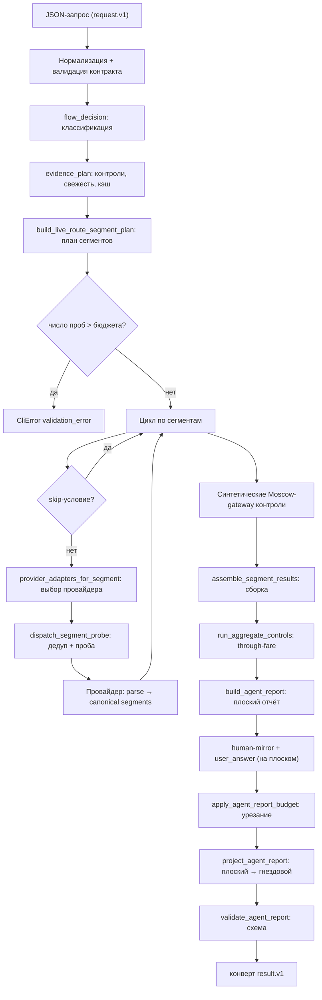

# Поток данных навыка `flight-search`

Сквозная карта прохождения данных от входного запроса до итогового ответа, со всеми развилками и ответвлениями. Документ описывает основной маршрут — команду `search` (`command_search` → `run_live_route_assembly`). Диагностические и сервисные команды (`diagnose *`, `maint *`) переиспользуют те же стадии точечно и вынесены в конец.

Ссылки даны на модули и функции (не на номера строк — они дрейфуют). Базовый путь пакета: `flights_cli/`.

-----

## 1. Слои (гексагональная раскладка)

|Слой            |Каталог                                             |Роль                                                              |
|----------------|----------------------------------------------------|------------------------------------------------------------------|
|Вход / CLI      |`cli.py`, `command_surface.py`, `commands/`, `apps/`|Разбор аргументов, маршрутизация команд, чтение/запись JSON       |
|Решение о потоке|`pipeline/`                                         |Классификация запроса, план доказательств, типизированные политики|
|Планирование    |`orchestrators/`, `domain/`                         |План сегментов маршрута, стратегии, тиры аэропортов               |
|Исполнение      |`execution/`                                        |Диспетчеризация проб, дедуп, журнал проб, классификация ошибок    |
|Порты/Адаптеры  |`ports/`, `adapters/providers/`                     |Контракт провайдера и адаптеры под него                           |
|Провайдеры      |`providers/`                                        |Kupibilet, FLI MCP, кэш, дорожная разведка, статический каталог   |
|Сборка          |`services/assembly.py`, `services/ranking.py`       |Сборка маршрутов, кандидаты, ранжирование                         |
|Отчётность      |`reporting/`                                        |Плоский отчёт → проекция → человеческое зеркало → бюджет          |
|Контракты       |`contracts/`                                        |JSON-схемы и реестр версий                                        |
|Состояние       |`store.py`, `io.py`, `output.py`                    |Каталог локаций/аэропортов, ввод-вывод                            |

Провайдеров в реестре два: `kupibilet` и `fli` (`adapters/providers/registry.py::PROVIDER_REGISTRY`). Документ `references/rail-rzd-live-pricing.md` относится к проработке, не к активному коду — рельсового пути в потоке нет.

-----

## 2. Контракты входа и выхода

**Вход** — файл `flight_search_request.v1` (`contracts/flight_search_request.v1.schema.json`). Верхний уровень: `origin`, `destination`, `depart_date`, `return_date?`, `currency`, `profile`, `ticketing`, `provider_policy` плюс четыре секции-словаря:

- `route_options` — стратегия, хабы, аэропорты, режим покрытия, stop-policy, окна дат, лимиты стыковок;
- `evidence` — бюджет проб, таймаут, кэш, контроль-агрегаты, смещения вторых ног, URL FLI MCP;
- `filters` — `only/exclude/prefer/avoid` перевозчики;
- `output` — лимиты вывода (кандидаты, ранжированные, отклонённые пары, сегменты).

`apps/search.py::live_assembly_args_from_search_request` разворачивает эти секции в `argparse.Namespace` (~60 полей) — это единственное место, где значения по умолчанию материализуются. Дальше весь пайплайн читает `args`.

**Выход** — конверт `flight_search_result.v1` (`apps/search.py::build_search_result`): `schema_version`, `wire_version`, `request`, `agent_report` (гнездовой отчёт), `route_result` (полный результат сборки с блоком `live_search`). Конверт валидируется перед возвратом.

-----

## 3. Магистральный поток (обзор)

Стадии: (4.1) нормализация → (4.2) решение о потоке → (4.3) план доказательств → (4.4) план сегментов → (4.5) исполнение проб → (4.6) провайдеры/нормализация → (4.7) сборка → (4.8) контрольные проверки → (4.9) отчётность.

-----

## 4. Стадии и развилки

### 4.1 Нормализация и валидация запроса

`apps/search.py::command_search`

1. `read_json_document(args.request)` — чтение файла запроса.
1. `normalize_search_request` — `origin/destination/currency` в верхний регистр; дефолты `profile=balanced`, `ticketing=separate`, `provider_policy=auto`.
1. `live_assembly_args_from_search_request` — валидация против контракта `search_request` (нарушение → `validation_error`), разворачивание секций в `Namespace`.
1. → `run_live_route_assembly(args, store)`.

**Развилка:** невалидный запрос обрывает поток здесь (`CliError`), до любых обращений к провайдерам.

### 4.2 Решение о потоке — `flow_decision`

`pipeline/flow_decision.py::decide_flow`. Производит `FlowDecision` из четырёх независимых классификаций. См. также `references/flow-decision-router.md`.

**Класс намерения** (`_intent_for`):

|Условие                                               |`intent_class`            |
|------------------------------------------------------|--------------------------|
|команда `maint*`                                      |`maintenance`             |
|`max_connections == 0` И `tier2_max_connections == 0` |`direct_inventory`        |
|`ticketing ∈ {single, protected, through, single_pnr}`|`ticketing_proof`         |
|задан scope перевозчика или аэропорта                 |`carrier_or_airport_scope`|
|иначе                                                 |`route_recommendation`    |

**Класс рынка** (`market_class_for_codes`) — по метаданным страны из каталога, не по спискам кодов:

|Страны origin/destination|`market_class`             |
|-------------------------|---------------------------|
|обе RU                   |`ru_domestic`              |
|одна RU                  |`ru_touching_international`|
|обе известны, не RU      |`global_non_ru`            |
|страна не определяется   |`structurally_constrained` |

**Класс доказательств** (`_evidence_class_for`): `maintenance→diagnostic_only`, `ticketing_proof→ticketing_required`, `{direct_inventory, carrier_or_airport_scope}→absence_claim`, иначе `shopping_advisory`.

**Стратегия маршрутизации** (`routing_strategy_for_market`):

|Условие                    |`routing_strategy`|
|---------------------------|------------------|
|задана явно (≠ auto)       |как указано       |
|есть ручные хабы           |`hub-list`        |
|`ru_domestic`              |`domestic-ru`     |
|`ru_touching_international`|`ru-priority`     |
|`global_non_ru` / прочее   |`hub-list`        |

**План провайдеров** (`_provider_plan`) — диспетч-карта на сегмент: `ru_touching_segments → kupibilet`, `non_ru_segments → fli` (при политике `auto`/`both`); флаг `ru_priority_controls = (routing_strategy == "ru-priority")`. Подробности выбора — в 4.5.

`route_mode` (`_route_mode`) сводит пары intent×strategy в режим: `direct_inventory / domestic_ru / ru_priority / hub_list / …`. `_limitations` добавляет предупреждения (например, `global_non_ru_with_ru_provider_override` при kupibilet на не-RU рынке).

### 4.3 План доказательств — `evidence_plan`

`pipeline/evidence_plan.py::plan_evidence` → `EvidencePlan`.

**Обязательные контроли** (`_required_controls`) — накапливаются по условиям:

|Условие                                                                     |Контроль                             |
|----------------------------------------------------------------------------|-------------------------------------|
|direct-only или `direct_inventory`                                          |`exact_airport_direct`               |
|задан `date_window_end`                                                     |`date_window_direct`                 |
|`routing_strategy == ru-priority`                                           |`moscow_gateway_direct`              |
|carrier/airport scope, либо `only_carrier`, либо `aggregate_control_carrier`|`carrier_aggregate`                  |
|`ticketing_required`                                                        |`full_route_aggregate`               |
|`absence_claim`/`ticketing_required` без других контролей                   |`exact_airport_direct` (по умолчанию)|

**Политика свежести** (`_freshness_policy`) — `requires_fresh_live = True`, если выполнено хоть одно:

- класс `absence_claim`;
- класс `ticketing_required`;
- запрос с `no_live_cache`;
- до вылета ≤ 2 дней (`days_until_departure`).

**Развилка кэша:** при `requires_fresh_live` кэш принудительно выключается (`live_cache_enabled=False`, `cache_ttl=0`) — это переопределяет пользовательский `live_cache_ttl_seconds`. Иначе кэш включён, если не задан `no_live_cache`.

`direct_route_intel_enabled = (не no_direct_route_intel) И (direct_route_index_ttl_seconds > 0)`. `missing_evidence` для `ticketing_required` = `single_pnr_or_protection_proof, baggage_through_proof`; для `absence_claim` = `targeted_live_controls_until_executed`.

### 4.4 План сегментов — `build_live_route_segment_plan`

`orchestrators/live_assemble.py`. Главное ветвление — по `routing_strategy` (после разрешения хабов через `resolve_route_graph_context`). Каждая ветка порождает список «ног» (`leg`), сгруппированных по семействам маршрутов (`route_family`).

**Ноги по стратегиям:**

|Стратегия                |Outbound-ноги                                                                             |Return-ноги                                             |
|-------------------------|------------------------------------------------------------------------------------------|--------------------------------------------------------|
|`direct-only`            |`direct_outbound` (по всем парам аэропортов × датам окна)                                 |`direct_return`                                         |
|`ru-priority`            |`direct_outbound` (контроль) + `origin_to_hub` → `hub_to_destination` через Moscow-gateway|`direct_return` + `destination_to_hub` → `hub_to_origin`|
|`domestic-ru`            |`direct_outbound` + `origin_to_hub` → `hub_to_destination`                                |зеркально                                               |
|`hub-list` (по умолчанию)|`origin_to_hub` → `hub_to_destination`                                                    |`destination_to_hub` → `hub_to_origin`                  |

**Ответвления планировщика:**

- **City-code-first / тиры аэропортов** (`city_code_first_segment_options`): kupibilet умеет запрос по городскому коду (например `MOW`) раньше точечных аэропортов. Точные аэропорты низшего тира помечаются `deferred` (`tier > 1`/`role=deferred`) и будут пропущены на исполнении, если городской запрос уже дал офферы. См. `references/provider-aware-airport-priority.md`.
- **Moscow gateway** (`moscow_gateway_eligible`): только `ru-priority` и origin/destination ≠ `MOW` → добавляются ноги через московские аэропорты (`KUPIBILET_CITY_CODE_FIRST_AIRPORTS["MOW"]`, `PRIORITY_MOSCOW_GATEWAY`).
- **Смещения вторых ног** (`normalize_day_offsets`): для стыковочных ног допускаются сдвиги дат 0–7 дней (`outbound/return_second_leg_day_offset`).
- **Direct-route intelligence** (`direct_route_intel_context`): если у пары есть `SVX` direct-контроль и включена разведка, подтягивается официальное сезонное расписание `SVX`; пары, которых в нём нет, помечаются к пропуску (см. 4.5, `direct_route_schedule_negative`).
- **Окно дат** (`resolve_date_window`): при `direct-only`/`date_window_end` direct-ноги размножаются по датам окна. См. `references/direct-date-window.md`.

`route_families_for_strategy` задаёт приоритеты семейств; `coverage_controls` (режим `targeted`/прочее) добавляют точечные контроли (`city_pair_direct`).

**Развилка бюджета** (в `run_live_route_assembly`): если запланированное `segment_search_count` превышает `max_segment_searches` → `CliError validation_error` ещё до исполнения. Также: при `routing_strategy == ru-priority` и пустом `prefer_carrier` автоматически подставляются `PRIORITY_ROUTE_CARRIERS`.

### 4.5 Исполнение проб — оркестратор + `probe_dispatcher`

`run_live_route_assembly` идёт циклом по `plan["segments"]`. Для каждого сегмента — сначала проверка skip-условий (`skipped_by_condition`), затем диспетчеризация.

**Выбор провайдера** (`adapters/providers/registry.py::providers_for_segment`) — ключевая развилка «кто обрабатывает сегмент»:

|`provider_policy`                                            |Провайдеры сегмента|
|-------------------------------------------------------------|-------------------|
|`kupibilet`                                                  |`[kupibilet]`      |
|`fli`                                                        |`[fli]`            |
|`both`                                                       |`[kupibilet, fli]` |
|`auto` + сегмент касается RU (origin/destination страна = RU)|`[kupibilet]`      |
|`auto` + сегмент не касается RU                              |`[fli]`            |

**Skip-условия (ответвления цикла)** — порядок проверки в `skipped_by_condition`:

|Условие                            |Причина (`reason`)                 |Когда срабатывает                                                                        |
|-----------------------------------|-----------------------------------|-----------------------------------------------------------------------------------------|
|`skipped_by_direct_route_intel`    |`direct_route_schedule_negative`   |direct-нога, но официальное расписание `SVX` не содержит этой пары                       |
|`skipped_by_preferred_airport_tier`|`preferred_airport_tier_has_offers`|низший (deferred) тир аэропорта, а высший тир уже дал офферы                             |
|`skipped_by_city_code_primary`     |`city_code_request_has_offers`     |точечный deferred-аэропорт, а городской запрос уже дал офферы                            |
|`skip_if_offer_exists`             |`direct_probe_has_offers`          |связная нога, а соответствующий direct-проб уже дал офферы                               |
|`skip_if_priority_route_viable`    |`priority_route_viable`            |`DXB` пропускается, если direct/SVO/IST приоритетный маршрут уже дал безошибочный journey|

**Дедуп** (`execution/request_deduper.py`): одинаковые пробы по ключу не повторяются — повтор помечается `deduped` и переиспользует результат оригинала.

**Диспетчер** (`execution/probe_dispatcher.py::dispatch_segment_probe`): для каждого выбранного адаптера делает claim у дедупера, запускает пробу, получает `ProviderProbeResult` со статусом `execution_state` и `cache_status`. Статусы пробы: `ok` / `deduped` / `skipped` / `error` / `not_supported`.

**Журнал проб** (`execution/probe_ledger.py`): каждая проба фиксируется (`record_searched/skipped/failed/not_supported/deduped`); в конце `finalize_unexecuted()`. Журнал проецируется в `coverage_diagnostics` отчёта — это аудит «что планировали / выполнили / пропустили / провалили».

Аккумуляторы по ходу цикла: `segment_results` (только ноги с офферами и флагом включения), `searches` (сводки всех проб), `failures`, `offer_counts` (по ключу ноги — питает skip-условия выше).

### 4.6 Провайдеры и нормализация в canonical `segments`

`providers/kupibilet.py`, `providers/fli_mcp.py` + адаптеры `adapters/providers/{kupibilet,fli}_adapter.py`.

Каждый провайдер парсит свой сырой ответ и приводит офферы к канону: список перелётов оффера лежит под ключом **`segments`** (а не `flights`). Это инвариант, введённый коммитом нормализации форматов; адаптеры (`_raw_offer_actual_airports`, `aggregate_offer_summary`) и доменный фильтр (`domain/provider_offer_filter.py::offer_segments`) читают только `segments`, fallback на `flights` удалён.

Номер рейса собирается в `kupibilet.py::kupibilet_flight_number`: `carrier + number`, но если сырой `number` уже содержит префикс перевозчика, префикс срезается, чтобы не было дублирования (`SU` + `SU6418` → `SU6418`, не `SUSU6418`).

Если провайдер не поддерживает тип пробы — `not_supported_probe_result` (адаптер возвращает `execution_state=not_supported`, нога не даёт офферов, но фиксируется в журнале).

### 4.7 Сборка — `assemble_segment_results`

`services/assembly.py`. Запускается, если есть `segment_results`; иначе `empty_assembled_result`.

Последовательность и ответвления:

1. **Связные пары** (`assemble_direction`) отдельно для outbound (`origin_to_hub`+`hub_to_destination`) и return (`destination_to_hub`+`hub_to_origin`). Внутри — проверка минимальной стыковки (`min_same_airport_min` / `min_cross_airport_min`), `pair_connection_quality` (severity), отбраковка в `rejected_pairs`.
1. **Прямые journeys** (`direct_journeys`) из `direct_outbound`/`direct_return`.
1. `outbound_journeys = direct + pairs` (так же для return).
1. **Бакеты stop-policy** (`split_journeys_by_stop_policy` через `journey_stop_policy_bucket` → `domain/stop_policy.py`): journey попадает в `preferred` / `tier2` / `suppressed` по числу стыковок относительно политики.
   
   |Политика (алиас)                            |preferred|tier2|hard|two-stop-тир|подавление 3+|
   |--------------------------------------------|---------|-----|----|------------|-------------|
   |`business-default` (= `allow-two-stop-tier`)|1        |2    |2   |да          |да           |
   |`strict-direct-one-stop`                    |1        |1    |1   |нет         |да           |
   |`debug-all`                                 |2        |99   |99  |да          |нет          |
   
   Алиас `allow-two-stop-tier` указывает на ту же политику, что и `business-default` (не отдельная пермиссивная). Переопределения `max_connections`/`tier2_max_connections` пересчитывают пороги поверх базовой политики; two-stop-тир активен только если `tier2 > preferred`. Запрос-уровневый «direct-only» (intent `direct_inventory`) — это `max_connections == 0 И tier2_max_connections == 0`; он независим от имени stop-policy и обнуляет пороги.
1. **Генерация кандидатов** (`generate_candidates_from_journeys`):
- **Первый проход — только `preferred`.** `generation_mode = preferred`.
- **Развилка tier2-fallback:** если из `preferred` кандидатов нет — повтор с `preferred + tier2`; при успехе `generation_mode = tier2`, `tier2_used = True`.
- **Round-trip vs one-way** (`require_both_directions`): round-trip (есть `return_date` или обе стороны имеют journeys) → пары outbound×inbound; иначе допускаются односторонние кандидаты.
1. `dedupe_candidates` → `duplicate_count`.
1. **Ранжирование** (`services/ranking.py::rank_candidate_list`): применяет политику перевозчиков (`only/exclude/prefer/avoid` → отфильтрованные с причинами) и профиль риска (`RISK_PROFILES[profile].rank_order`, например `[reject, risk, price, elapsed]`), плюс `stop_policy_diagnostics`.
1. `recommendation_summary`, `frontier_candidates`; усечение `ranked` до `max_candidates`.
1. **`direct_flights`**: из одиночных прямых journeys (`outbound_direct + return_direct`) собирается список сводок (направление, номер рейса, перевозчики, аэропорты, времена, длительность, борт, цена). Кладётся в `assembly["direct_flights"]`.

Результат `assemble_segment_results` — словарь `ranked` с полями `ranked`, `candidates`, `ranked_candidates`, `rejected_pairs`, `recommendations`, `assembly` (счётчики), `stop_policy_diagnostics`. Оркестратор добавляет к нему блок `live_search` (см. ниже).

### 4.8 Контрольные проверки

После основного цикла оркестратор дособирает доказательную обвязку:

- **Синтетические Moscow-gateway контроли** (`ensure_moscow_gateway_control_synthesized` / `synthesize_moscow_gateway_control_results`) — достраивают недостающие gateway-сводки для `ru-priority`.
- **Date-window инвентарь** (`build_date_window_inventory`) — поофферное наличие direct по датам окна (если применимо). Кладётся в `live_search.date_window_inventory`.
- **Aggregate controls / through-fare** (`run_aggregate_controls` → `reporting/through_fare_analyzer.py::through_fare_checks`): для явных перевозчиков и `ticketing_required` проверяется возможность единого тарифа/PNR на полный маршрут. Это путь «доказательства провозной слитности».
- **Coverage controls** (`city_pair_direct`) — планируются в журнал.
- **Direct-route intelligence** — итоговая сводка `direct_route_intel` (включено/недоступно/причина) попадает в `live_search.direct_route_intelligence`.

**Развилка источника** (`provider_policy`): при `kupibilet` метка источника — «Kupibilet frontend_search …»; иначе — «Provider-policy live segment assembly» с пометкой, что kupibilet идёт на RU-сегменты, FLI — на не-RU.

Блок `live_search` несёт: `segment_searches`, `hub_viability`, `aggregate_controls`, `probe_ledger` (→ coverage diagnostics), `direct_route_intelligence`, `failures`, и опционально `date_window_inventory`.

### 4.9 Отчётность — построение, проекция, валидация

`reporting/agent_report_builder.py::build_agent_report` → собирает **плоский** отчёт из `data` (`assembly`, `live_search`, `plan`):

- `route` (origin/destination/airports/dates/profile/routing_strategy/provider_policy/flow_decision/evidence_plan);
- `status` (счётчики ранжирования/кандидатов, `failure_count`);
- доказательная часть: `source_boundaries`, `hub_viability`, `segment_searches`, `provider_failures`, `aggregate_controls`, `coverage_diagnostics`, `stop_policy`, `stop_policy_diagnostics`, `through_fare_checks`, `rejected_pair_warnings`, **`direct_flights`**;
- варианты: `recommended_options` (топ ранжированных), `priority_options` (приоритетные + агрегатные + ru-priority);
- условные ключи: `date_window_inventory`, `ru_priority_controls`;
- проекции: `offer_graph`, `display`, `answer_lines`.

**Порядок (важно для понимания, где что видно):**

1. Плоский отчёт собран (с верхнеуровневым `direct_flights`).
1. `build_human_answer_mirror(report)` и `build_user_answer(report, …)` строятся **на плоском** отчёте → человеческие секции (включая «Все прямые туда/обратно») видят `direct_flights` здесь.
1. `apply_agent_report_budget(report)` — урезает топ-листы (`recommended_options`, `priority_options`, `segment_searches`, `provider_failures`, `answer_lines`, `coverage_controls`) до лимитов, пишет `omitted_counts`; при превышении `max_bytes` дополнительно режет сегменты опций.
1. `project_agent_report(report)` — пересобирает плоский отчёт в **гнездовую** форму: `route / evidence / frontier / user_answer / agent_guidance / diagnostics`. Машинный `direct_flights` живёт в `evidence` (ручной whitelist проектора переносит его явно — иначе ключ молча терялся бы).
1. `attach_agent_report` (`services/agent_report.py`) вызывает `validate_agent_report(report)` — валидация гнездового отчёта против `contracts/agent_report.v2.schema.json`. Нарушение схемы → `CliError` (не молчаливый дроп). Схема `search_evidence` имеет `additionalProperties: false`, поэтому любой ключ в `evidence` обязан быть в `properties` схемы.

`agent_report` кладётся в `data["agent_report"]`, и `build_search_result` оборачивает всё в конверт `result.v1`.

-----

## 5. Сводный перечень развилок

|# |Развилка                         |Где                                        |Условие/ось                                     |Исходы                                                                                                               |
|--|---------------------------------|-------------------------------------------|------------------------------------------------|---------------------------------------------------------------------------------------------------------------------|
|1 |Валидность запроса               |`apps/search.py`                           |контракт `search_request`                       |продолжить / `validation_error`                                                                                      |
|2 |Класс намерения                  |`flow_decision._intent_for`                |команда, direct-only, ticketing, scope          |maintenance / direct_inventory / ticketing_proof / carrier_or_airport_scope / route_recommendation                   |
|3 |Класс рынка                      |`flow_decision.market_class_for_codes`     |страны origin/destination                       |ru_domestic / ru_touching_international / global_non_ru / structurally_constrained                                   |
|4 |Стратегия маршрутизации          |`flow_decision.routing_strategy_for_market`|явная / хабы / рынок                            |direct-only / ru-priority / domestic-ru / hub-list                                                                   |
|5 |Обязательные контроли            |`evidence_plan._required_controls`         |intent + опции                                  |набор из exact_airport_direct / date_window_direct / moscow_gateway_direct / carrier_aggregate / full_route_aggregate|
|6 |Свежесть/кэш                     |`evidence_plan._freshness_policy`          |absence/ticketing/no_cache/≤2 дней              |кэш вкл. / кэш принудительно выкл.                                                                                   |
|7 |Ветка плана сегментов            |`build_live_route_segment_plan`            |routing_strategy + direct_only                  |наборы ног (см. 4.4)                                                                                                 |
|8 |Moscow gateway                   |планировщик                                |ru-priority и origin/dest ≠ MOW                 |добавить gateway-ноги / нет                                                                                          |
|9 |Тиры аэропортов / city-code-first|`city_code_first_segment_options`          |поддержка провайдера, deferred-тиры             |городской запрос → точечные deferred-пробы                                                                           |
|10|Бюджет проб                      |`run_live_route_assembly`                  |`segment_search_count` vs `max_segment_searches`|продолжить / `validation_error`                                                                                      |
|11|Выбор провайдера                 |`registry.providers_for_segment`           |policy + RU-касание сегмента                    |kupibilet / fli / оба                                                                                                |
|12|Skip: direct-route schedule      |`skipped_by_direct_route_intel`            |расписание SVX                                  |пропуск direct-ноги                                                                                                  |
|13|Skip: preferred-тир              |`skipped_by_preferred_airport_tier`        |высший тир дал офферы                           |пропуск deferred-тира                                                                                                |
|14|Skip: city-code primary          |`skipped_by_city_code_primary`             |городской запрос дал офферы                     |пропуск точечной deferred-пробы                                                                                      |
|15|Skip: direct уже есть            |`skip_if_offer_exists`                     |direct-проб дал офферы                          |пропуск связной ноги                                                                                                 |
|16|Skip: priority route viable      |`skip_if_priority_route_viable`             |приоритетный маршрут безошибочен                |пропуск DXB                                                                                                          |
|17|Дедуп пробы                      |`request_deduper`                          |совпадение ключа                                |выполнить / `deduped` (переиспользовать)                                                                             |
|18|Поддержка пробы                  |адаптер провайдера                         |capability                                      |ok / `not_supported`                                                                                                 |
|19|Бакет stop-policy                |`journey_stop_policy_bucket`               |число стыковок vs политика                      |preferred / tier2 / suppressed                                                                                       |
|20|Генерация кандидатов             |`assemble_segment_results`                 |есть ли preferred-кандидаты                     |preferred / **tier2-fallback**                                                                                       |
|21|Round-trip vs one-way            |`generate_candidates_from_journeys`        |return_date / наличие обеих сторон              |пары / односторонние                                                                                                 |
|22|Фильтр перевозчиков              |`services/ranking.py`                      |only/exclude/prefer/avoid                       |принят / отфильтрован (с причиной)                                                                                   |
|23|Метка источника                  |оркестратор                                |provider_policy                                 |Kupibilet-only / provider-policy                                                                                     |
|24|Бюджет отчёта                    |`apply_agent_report_budget`                |лимиты + max_bytes                              |полный / урезанный (`omitted_counts`)                                                                                |
|25|Условные ключи отчёта            |`build_agent_report`                       |наличие данных                                  |+ `date_window_inventory` / + `ru_priority_controls`                                                                 |
|26|Валидация отчёта                 |`validate_agent_report`                    |схема v2                                        |ok / `CliError`                                                                                                      |

-----

## 6. Карта артефактов данных

Что за структура течёт между стадиями:

1. **`request` (dict)** — нормализованный JSON запроса.
1. **`Namespace` (args)** — развёрнутые ~60 параметров (единственная материализация дефолтов).
1. **`SearchRequest` / `FlowDecision` / `EvidencePlan`** — типизированные `frozen dataclass` решения: классы намерения/рынка/доказательств, стратегия, план провайдеров, обязательные контроли, политика свежести/кэша.
1. **`plan` (dict)** — план сегментов: `segments[]` (каждый со `direction/leg/date/origin/destination/route_family/priority` и метаданными тиров), `dates`, `routing_strategy`, `coverage_controls`, `metrics`.
1. **`segment_results[]` (dict)** — ноги с офферами; каждый оффер канонизирован под ключ `segments`.
1. **`assembled` (dict)** — результат сборки (`ranked`, `candidates`, `rejected_pairs`, `assembly` со счётчиками и `direct_flights`) + добавленный оркестратором блок `live_search` (`segment_searches`, `hub_viability`, `aggregate_controls`, `probe_ledger`, `direct_route_intelligence`, `failures`, `date_window_inventory?`).
1. **Плоский `report` (dict)** — доказательная модель: `route/status/evidence-ключи/options/direct_flights/…` + `human_answer`/`user_answer` (построены здесь).
1. **Гнездовой `agent_report` (dict)** — после бюджета и проекции: `route / evidence / frontier / user_answer / agent_guidance / diagnostics`; провалидирован схемой v2.
1. **`result` (dict)** — конверт `flight_search_result.v1`: `request`, `agent_report`, `route_result`.

-----

## 7. Связанные тематические документы

- `references/flow-decision-router.md` — классификация и маршрутизация (стадия 4.2).
- `references/provider-aware-airport-priority.md` — тиры аэропортов и city-code-first (4.4, 4.5).
- `references/direct-date-window.md` — окна дат и direct-инвентарь (4.4, 4.8).
- `references/report-contract.md` — контракт отчёта (4.9).
- `references/source-boundaries.md` — границы источников и трактовка пустых ответов.
- `references/cli-maintenance.md` — обслуживающие команды и каталог.
- `references/debug-playbook.md` — отладочные сценарии.

-----

## Приложение. Сервисные команды (точечное переиспользование стадий)

- `diagnose plan` — только стадия 4.4 (план сегментов), без обращений к провайдерам.
- `diagnose probe` — одна проба провайдера (4.5/4.6) из JSON.
- `diagnose render` — только 4.9 (человеческое зеркало) из готового `agent_report`.
- `diagnose kb-search` / `kb-roundtrip` — живой агрегат Kupibilet (4.6/4.8).
- `diagnose fli-search` / `fli-dates` — живой FLI MCP (4.6).
- `maint check` / `doctor` / `catalog manifest|refresh` — статус кэшей и статического каталога без провайдеров.